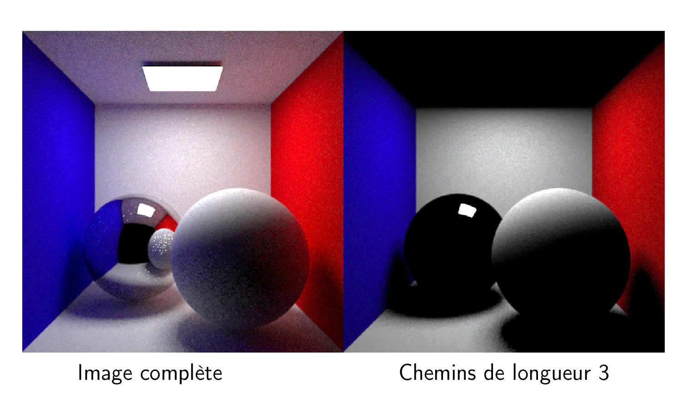

# Introduction to light synthesis

Guillaume.Bouchard@tweag.io

20 june, 2018

---

# Valeo lighting systems

- Virtual prototyping of (car) lamp

Challenges:

- Physically based rendering
- Finale images must look like photography
- Complex light paths (polarisation, interferences)

---

(One day of rendering on a 2010 high end workstation)

---

# Mercenaries engineering

- Animation movies, you may have seen some

Challenges:

- Complex scenes (lot of geometry, details, materials, textures, lampes)
- Artistic freedom

---

---

- Watch the trailer with me

https://www.youtube.com/watch?v=fEPqgSNLfK8

---

## Artistic freedom

---

# Image Synthesis

---

## Modelisation

---

## Simulation

---

## What is an image?

---

## Rendering Equation

---

## Rendering Equation

---

## Rendering Equation

---

## Rendering Equation

---

## Rendering Equation

---

## Rendering Equation

---

# Materiel models

---

## Diffuse surface

$$f(\omega_i, \omega_o) \propto C$$

---

## Glossy surface

$$f(\omega_i, \omega_o) \propto |\omega_i . n| ^ p$$

---

## Perfect mirror

$$f(\omega_i, \omega_o) \propto \delta (\omega_o - reflect(\omega_i))$$

---

## Perfect glass

$$f(\omega_i, \omega_o) \propto \delta (\omega_o - refract(\omega_i))$$

(Snell's law)

---

## Material model in action

(Blender live demo)

---

# How to render?

---

- Can we solve the rendering equation?

- Too complex:

- --> Monte Carlo

---

## Monte Carlo in 5 minutes

---

## Monte Carlo

---

## Number of samples

---

## Sampling strategy

---

## Example: uniform

---

## Example: "importance"

---

# How to sample a path?

---

---

---

---

---

---

# Which strategy should I use?

---

---

---

---

---

## Multiple importance sampling

---

---

# A few other interesting topics

---

## Acceleration structures

- Ray test intersection: `O(n)`

---

## Acceleration structures

---

## Adaptive sampling

---
## Adaptive sampling: heat map

---

## Numbers

- 4K images (8 millions pixels), 100 layers, stereo
  - --> 25 Giga bytes of memory just for the final image

- from a few to millions of lights
- millions of geometry instances (composed of millions of triangles)

- One scene with 40 Giga bytes of memory for transformations matrices

- The little prince: 1 Tera bytes of texture in one image

---

## Numbers

- 25 images / second
- 1h30 movies

---

# Trivia: My first haskell project

- With a friend
- Haskell ray tracer
- I was supposed to teach him image synthesis
- We tried Haskell, because it looked boring (who uses types in 2015?)

https://github.com/gbataille/halray

---

# SmallPTHS

https://github.com/guibou/smallPTHS

- An experiment on raytracing / haskell / performance
- Goal: match the performance of `smallpt.cpp`, a reference implementation

- Laptop: Intel Core i7-4700HQ @ 2.4 GHz (4 cores, 8 threads) : 1.40x slower in linear, 1.7x slower in parallel.
- Workstation: Intel Core i7-6800K CPU @ 3.40GHz (6 cores, 12 threads) : 1.60x slower in linear, 3.2x slower in parallel.

- Great (and there is still a space leak and allocation in the main loop)
---

# Conclusion

- Thank you
- Questions ?

---

# Backup slides

---

## Rendering Equation

---

## Rendering Equation

---

## Quantites

